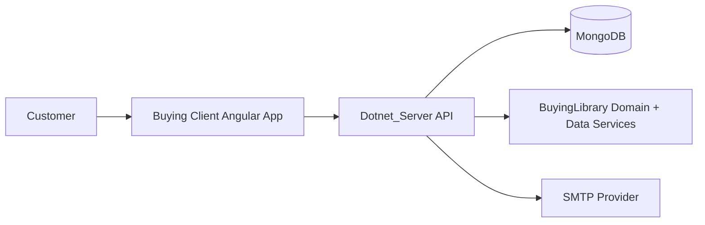
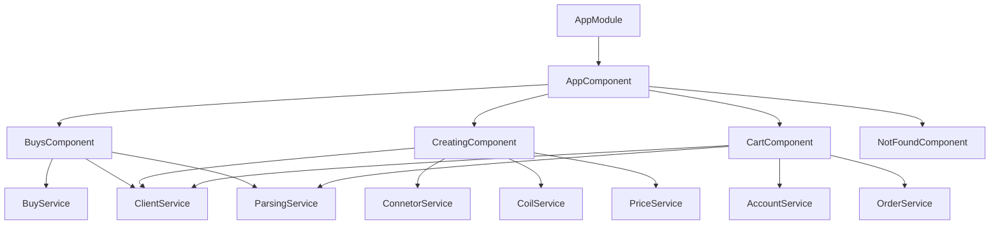
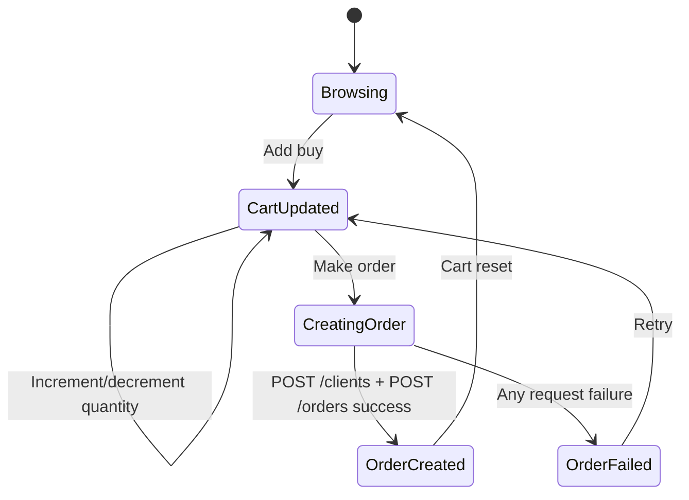
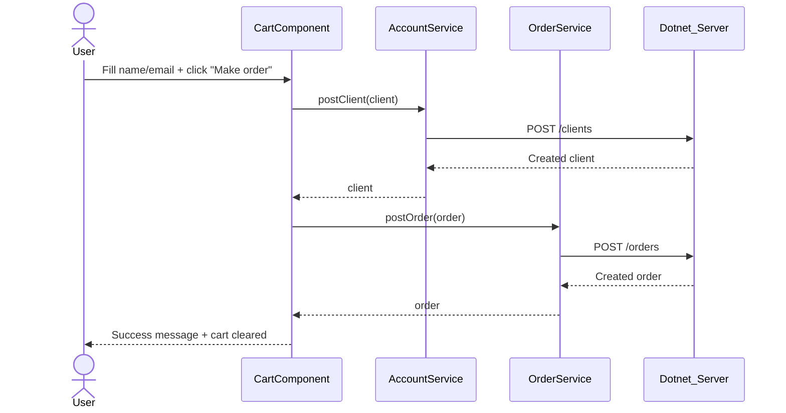

# Architecture

## System context

```mermaid
flowchart LR
  User[Customer] --> UI[Buying Client Angular App]
  UI --> API[Dotnet_Server API]
  API --> DB[(MongoDB)]
  API --> LIB[BuyingLibrary Domain + Data Services]
  API --> MAIL[SMTP Provider]
```

## Frontend module/component interaction

```mermaid
flowchart TD
  AppModule --> AppComponent
  AppComponent --> BuysComponent
  AppComponent --> CreatingComponent
  AppComponent --> CartComponent
  AppComponent --> NotFoundComponent

  BuysComponent --> BuyService
  BuysComponent --> ClientService
  BuysComponent --> ParsingService

  CreatingComponent --> ConnetorService
  CreatingComponent --> CoilService
  CreatingComponent --> PriceService
  CreatingComponent --> ClientService

  CartComponent --> ClientService
  CartComponent --> AccountService
  CartComponent --> OrderService
  CartComponent --> ParsingService
```

## Cart/order state flow

```mermaid
stateDiagram-v2
  [*] --> Browsing
  Browsing --> CartUpdated: Add buy
  CartUpdated --> CartUpdated: Increment/decrement quantity
  CartUpdated --> CreatingOrder: Make order
  CreatingOrder --> OrderCreated: POST /clients + POST /orders success
  CreatingOrder --> OrderFailed: Any request failure
  OrderCreated --> Browsing: Cart reset
  OrderFailed --> CartUpdated: Retry
```

## Create order sequence

```mermaid
sequenceDiagram
  actor U as User
  participant C as CartComponent
  participant AS as AccountService
  participant OS as OrderService
  participant API as Dotnet_Server

  U->>C: Fill name/email + click "Make order"
  C->>AS: postClient(client)
  AS->>API: POST /clients
  API-->>AS: Created client
  AS-->>C: client
  C->>OS: postOrder(order)
  OS->>API: POST /orders
  API-->>OS: Created order
  OS-->>C: order
  C-->>U: Success message + cart cleared
```
