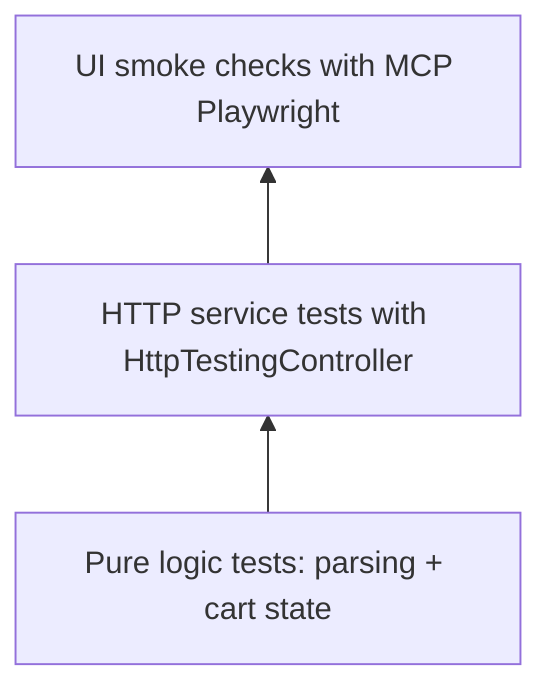

# Testing strategy

## Test pyramid



## Implemented automated tests

- `src/app/services/parsing.service.spec.ts`
  - delimiter parsing behavior
- `src/app/services/client.service.spec.ts`
  - add/merge/remove cart state behavior
- `src/app/services/buy.service.spec.ts`
  - buys endpoint call + image endpoint route + legacy field mapping
- `src/app/services/order.service.spec.ts`
  - order posting payload sanitization
- `src/app/components/app.component.spec.ts`
  - component creation + reactive count/cost updates

## Executing tests

```bash
npm test -- --watch=false --browsers=ChromeHeadless
```

## UI verification

- Use MCP Playwright against `npm start` to validate:
  - route shell loads
  - cart summary renders
  - navigation between main/cart/creating pages works
- Full backend-coupled end-to-end scenarios require running `Dotnet_Server` with seeded data.
